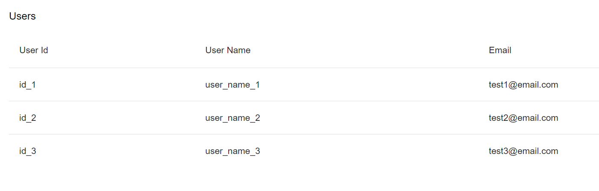

# Signal Testing Application

## Overview

This application showcases user data using an Angular Material table component. The app uses Angular's (v17.1.0-rc.0)
latest features, including standalone components and Signals for managing application state.



## Features

- Fetches user data using a service that returns a Signal.
- Displays user data in a Material table.

## Installation

Ensure you have [Node.js](https://nodejs.org/) and [Angular CLI](https://cli.angular.io/) installed.

1. Clone the repository:

```bash
git clone git@github.com:jzolnowski/signal-testing.git
```

2. Install the dependencies:

```bash
npm install
```

## Running the Application

To start the application, please run the following command:

```bash
npm start
```

This will serve the app on `http://localhost:4200`.

## Building the Application

To build the application for production, run:

```bash
npm run build
```

The build artifacts will be stored in the `dist/` directory.

## Running Unit Tests

Execute the unit tests via [Karma](https://karma-runner.github.io):

```bash
npm test
```

Unit tests are written using Jasmine. The tests cover the service and component functionality, ensuring that user data
is fetched and displayed correctly.

## Services and Components

### UsersService

Responsible for providing user data as a Signal. It mocks an Observable stream of users that is then converted into a
Signal using Angular's toSignal function.

### UserListComponent

A standalone component that subscribes to the UsersService to receive user data and populates a Material table. It also
manages a loading state through the isLoading signal.

## License

This project is open-sourced under the MIT license.
